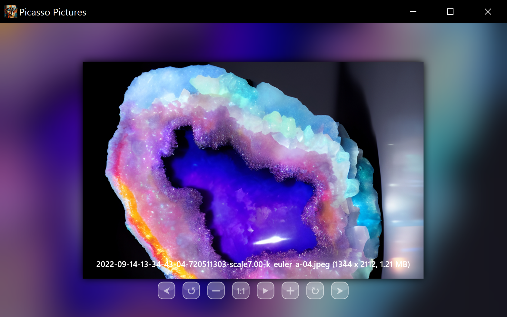

# Picasso Pictures

A lightweight, GPU-accelerated image viewer for Windows with a focus on smooth animations and a clean, minimal UI.

Built with Direct2D, Direct3D 11, and WIC (Windows Imaging Component).

## **Download** (Win10 x86, latest release) [here](https://github.com/LuisJalabert/Picasso-Pictures/releases/download/1.3/Picasso.Pictures.exe)

[Bug reports](mailto:luisjalabert@gmail.com)

---

## Features

- **Smooth zoom and pan** with animated transitions
- **Fullscreen mode** — double-click or press `F` to enter; the image flies in from its windowed position
- **Slideshow mode** — automatically advances through images in the folder with cross-fade transitions and a blurred background
- **Blurred background** — the current image is used as a softly blurred, cover-scaled background in both windowed and fullscreen modes
- **Animated GIF support** with correct per-frame delay timings
- **Per-image state memory** — zoom, pan, and rotation are remembered for each file in the session
- **File deletion** — send to Recycle Bin or permanently delete from inside the viewer
- **Dark UI** — blurred-glass buttons that adapt to whatever is behind them

---

## Supported Formats

`JPG` · `JPEG` · `PNG` · `BMP` · `GIF` (animated) · `TIFF` · `TIF` · `WEBP`

---

## Usage

**Open an image** by:
- Clicking the 📂 button in the top-left corner
- Pressing `O`
- Dragging and dropping an image file onto the window
- Launching with a file path as a command-line argument (e.g. from "Open with")

Once an image is open, the viewer automatically finds all other supported images in the same folder and lets you browse through them.

---

## Controls

### Mouse

| Action | Result |
|---|---|
| Scroll wheel | Zoom in / out |
| Click and drag | Pan the image |
| Double-click image | Enter fullscreen |
| Double-click outside image | Exit fullscreen |
| Click outside image (fullscreen) | Exit fullscreen |

### Keyboard

| Key | Action |
|---|---|
| `A` / `←` | Previous image |
| `D` / `→` / `Space` | Next image |
| `W` / `↑` | Zoom in |
| `S` / `↓` | Zoom out |
| `Q` | Rotate 90° counter-clockwise |
| `E` | Rotate 90° clockwise |
| `F` | Toggle fullscreen |
| `F5` | Toggle slideshow mode |
| `O` | Open file dialog |
| `Delete` | Send current file to Recycle Bin |
| `Shift + Delete` | Permanently delete current file |
| `Escape` | Exit slideshow → exit fullscreen → quit |

### On-screen Buttons

Buttons appear when your mouse moves near the bottom of the screen (or the top-right corner for Exit). They have a blurred-glass background.

| Button | Action |
|---|---|
| 📂 | Open file |
| ❓ | Help |
| `1:1` | Reset zoom to 100% |
| `▶` | Start slideshow |
| `⊕` / `⊖` | Zoom in / out |
| `⭯` / `⭮` | Rotate left / right |
| `⮜` / `⮞` | Previous / next image |
| `❌` | Exit (fullscreen only) |

---

## Slideshow Mode

Press `F5` or click `▶` to enter slideshow mode. The screen fades to black, then the viewer enters fullscreen and begins automatically advancing through all images in the folder.

- Images cross-fade with a blurred, cover-scaled background
- Default interval: **5 seconds**
- Manual navigation with `A`/`D` or the arrow buttons resets the timer
- Press `Escape` or `F5` to exit

---

## Building

**Requirements:**
- Windows 10 or later
- Visual Studio 2019 or later
- Windows SDK 10.0+

**Dependencies** (all system libraries, no external packages needed):
`d2d1` · `d3d11` · `dxgi` · `dxguid` · `dwrite` · `windowscodecs` · `dwmapi` · `uxtheme` · `shell32`

Open `Picasso Pictures.sln` in Visual Studio and build in Release x64.

---

## License

[PolyForm Noncommercial License 1.0.0](https://polyformproject.org/licenses/noncommercial/1.0.0/)

Free to use, share, and modify for non-commercial purposes.
